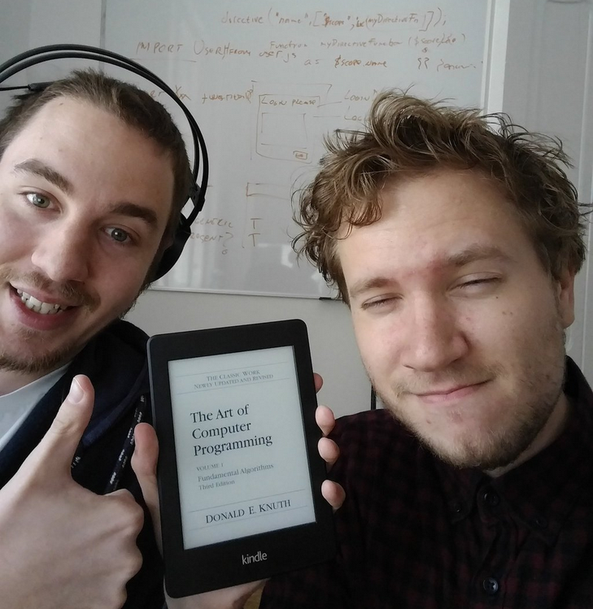
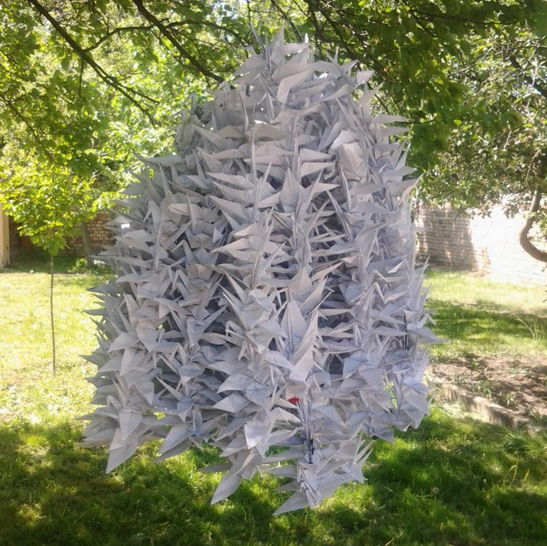

Hi there, dear visitor! My name is Igor, and as you can probably deduce from the
title, I am a nerd, with a passion for everything nerdy. Be it computers, anime,
swords, chess, cosplay, origami, or any other weird hobby, I probably enjoy it.

Currently, I am `Time.now - 1991 #=> 25` years old.

I live in a beautiful city near the
great river Danube &mdash; [Novi Sad](https://en.wikipedia.org/wiki/Novi_Sad),
spending my days hacking the hidden & dirty parts of the continuous delivery
service &mdash; [Semaphore](https://semaphoreci.com/).

### Hacker / Engineer

I've picked up the hobby of programming when I was a little kid. Even after 16
years of sitting in front of a monitor, I still carry an endless passion for
the craft. With time, I got quite good at my hobby, and I have even reached a
point when people want to pay me actual money to write code and have fun.

Random programming facts about me:

- I don't really have a favorite language, I love them all. Especially Lisp.
    JavaScript is good too. Lately I enjoy Elixir. And when the moments are
    ready I like to go hardcore and write something in C.

- Vim is the best editor. Period. Or emacs. I can even live with `ed`.

- The terminal is the best IDE you can use.

- Any unix is based system is fine. I don't really have a preference. However, I
    have been running [Arch Linux](https://www.archlinux.org/) and
    [Ubuntu](http://www.ubuntu.com/) on my personal machines for the last 10
    years.

### Total weaboo

Besides software development, I am for some unknown reason very passionate for a
lot a Japanese things.

I have grown up watching Dragon Ball, Yu Yu Hakusho, Trigun and similar classics,
and I haven't left my hobby of watching cartoons till this day.

I also enjoy origami. I have even completed several
[senbazurus](https://en.wikipedia.org/wiki/One_thousand_origami_cranes) when I
was younger and had a bit more time to waste. This was my first one:

